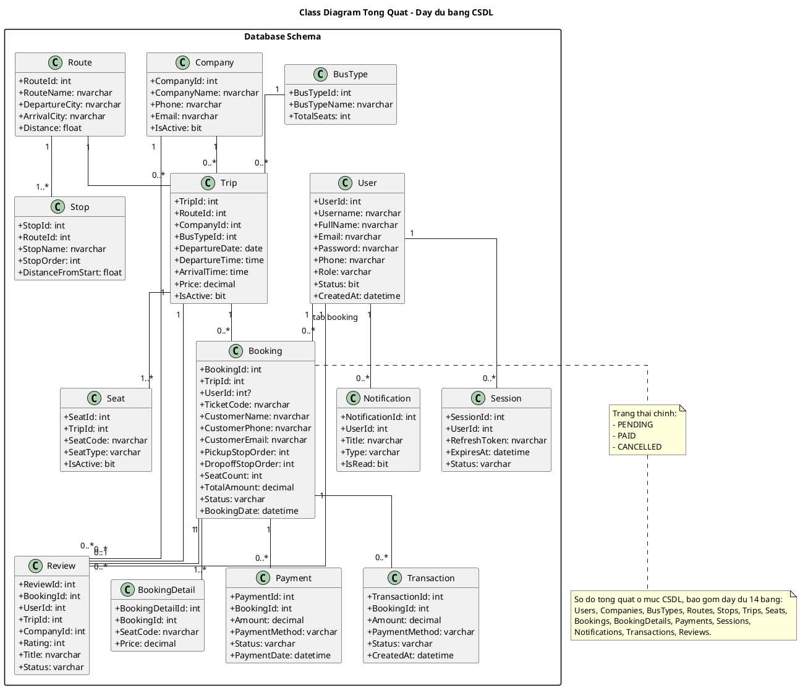

# BÁO CÁO ĐỒ ÁN TỐT NGHIỆP

## HỆ THỐNG ĐẶT VÉ XE KHÁCH TRỰC TUYẾN

---

# CHƯƠNG 1: GIỚI THIỆU

## 1.1 Đặt vấn đề nghiên cứu

Trong bối cảnh chuyển đổi số đang diễn ra mạnh mẽ tại Việt Nam, ngành vận tải hành khách đường bộ đang đối mặt với nhiều thách thức trong việc quản lý và bán vé xe khách. Phương thức bán vé truyền thống tại quầy bến xe bộc lộ nhiều hạn chế: hành khách phải di chuyển đến bến xe để mua vé, xếp hàng chờ đợi, không thể chủ động lựa chọn ghế ngồi, và thường gặp tình trạng hết vé vào mùa cao điểm. Về phía nhà xe, việc quản lý thủ công dẫn đến sai sót trong thống kê, khó kiểm soát doanh thu, và thiếu công cụ phân tích kinh doanh hiệu quả.

Theo thống kê, thị trường đặt vé xe khách trực tuyến tại Việt Nam đang tăng trưởng mạnh mẽ với các nền tảng như Vexere.com, VeXeRe, và các ứng dụng di động. Tuy nhiên, việc xây dựng một hệ thống đặt vé hoàn chỉnh từ đầu đến cuối, bao gồm cả xử lý xung đột ghế theo chặng (segment-based booking), thanh toán trực tuyến, và quản trị hệ thống, vẫn là một bài toán phức tạp đòi hỏi kiến thức sâu rộng về phát triển phần mềm.

Xuất phát từ thực tiễn trên, đề tài **"Xây dựng hệ thống đặt vé xe khách trực tuyến"** được thực hiện nhằm nghiên cứu và phát triển một giải pháp web ứng dụng hoàn chỉnh, mô phỏng quy trình đặt vé từ tìm kiếm chuyến xe, chọn ghế, thanh toán đến nhận vé điện tử.

## 1.2 Mục tiêu nghiên cứu

### 1.2.1 Mục tiêu chung

Xây dựng một hệ thống đặt vé xe khách trực tuyến hoàn chỉnh, cho phép hành khách tìm kiếm, đặt vé, thanh toán và nhận vé điện tử qua nền tảng web. Hệ thống đồng thời cung cấp công cụ quản trị cho nhà xe và quản trị viên để quản lý chuyến xe, theo dõi doanh thu và vận hành kinh doanh hiệu quả.

### 1.2.2 Mục tiêu cụ thể

- **Xây dựng module tìm kiếm chuyến xe**: Cho phép tìm kiếm theo tuyến đường, ngày khởi hành, với hiển thị thông tin chi tiết về nhà xe, loại xe, giá vé và tiện ích.
- **Xây dựng module đặt vé thông minh**: Hỗ trợ sơ đồ ghế trực quan, đặt vé theo chặng (segment-based booking) với cơ chế khóa ghế tạm thời (10-15 phút) sử dụng Stored Procedure với SERIALIZABLE isolation level để tránh xung đột.
- **Xây dựng module thanh toán**: Giả lập thanh toán qua mã QR, xác nhận thanh toán tự động và hiển thị vé điện tử với mã vạch.
- **Xây dựng hệ thống xác thực và phân quyền**: Đăng ký, đăng nhập với JWT (JSON Web Token), mã hóa mật khẩu bằng bcrypt, phân quyền 3 cấp (Guest, Customer, Admin).
- **Xây dựng trang quản trị Admin**: Dashboard thống kê doanh thu, quản lý chuyến xe/tuyến đường/nhà xe/đặt vé/đánh giá/tài khoản người dùng.
- **Tích hợp AI Chatbot**: Sử dụng Google Gemini API để hỗ trợ khách hàng 24/7.
- **Xây dựng tính năng theo dõi hành trình**: Hiển thị vị trí chuyến xe trên bản đồ với tuyến đường thực tế (OSRM routing).

## 1.3 Phạm vi nghiên cứu

### 1.3.1 Không gian

Hệ thống được phát triển và triển khai dưới dạng ứng dụng web chạy trên môi trường local (localhost). Dữ liệu mẫu bao gồm **8 tuyến đường** phổ biến tại Việt Nam (TP.HCM - Đà Lạt, TP.HCM - Nha Trang, TP.HCM - Vũng Tàu, Đà Nẵng - Hội An, Hà Nội - Sa Pa, Hà Nội - Hải Phòng, TP.HCM - Cần Thơ, TP.HCM - Buôn Ma Thuột), **5 nhà xe** (Phương Trang, Thành Bưởi, Hoàng Long, Kumho Samco, Hải Vân), và **33 điểm dừng** trên các tuyến.

### 1.3.2 Thời gian

Đề tài được thực hiện trong năm 2025, với phiên bản hiện tại là Version 2.0 - Production Ready.

### 1.3.3 Đối tượng nghiên cứu

- **Khách vãng lai (Guest)**: Người dùng chưa đăng nhập, có thể tìm kiếm chuyến xe, xem sơ đồ ghế, theo dõi hành trình, chat với trợ lý AI.
- **Khách hàng (Customer)**: Người dùng đã đăng nhập, có thể đặt vé, thanh toán, quản lý vé, xem lịch sử, đánh giá chuyến đi.
- **Quản trị viên (Admin)**: Quản lý toàn bộ hệ thống bao gồm chuyến xe, tuyến đường, nhà xe, đặt vé, đánh giá, tài khoản và xem thống kê.

## 1.4 Ý nghĩa nghiên cứu

**Ý nghĩa khoa học**: Đề tài áp dụng các kiến thức về lập trình web full-stack, thiết kế cơ sở dữ liệu quan hệ, xử lý đồng thời (concurrency control), kiến trúc RESTful API, và tích hợp trí tuệ nhân tạo vào ứng dụng thực tế.

**Ý nghĩa thực tiễn**:

- Cung cấp giải pháp mô phỏng hoàn chỉnh quy trình đặt vé xe khách trực tuyến.
- Giải quyết bài toán xung đột ghế khi nhiều người đặt cùng lúc bằng cơ chế SERIALIZABLE isolation level.
- Hỗ trợ đặt vé theo chặng (segment-based), cho phép tối ưu hóa sử dụng ghế trên các tuyến đường dài.
- Tích hợp AI chatbot giúp nâng cao trải nghiệm người dùng.

## 1.5 Phương pháp tiếp cận và phát triển phần mềm

Dự án áp dụng phương pháp phát triển phần mềm **Agile** theo mô hình **Scrum**, phù hợp với đặc thù đồ án có quy mô vừa, yêu cầu thay đổi linh hoạt và cần phản hồi nhanh trong quá trình phát triển. Quy trình được chia thành **5 Sprint**, mỗi Sprint kéo dài khoảng 2-3 tuần:

**Sprint 1 – Thu thập yêu cầu và phân tích hệ thống**

- Khảo sát các hệ thống đặt vé hiện có (Vexere.com, VeXeRe) để xác định các tính năng cốt lõi.
- Xác định đối tượng sử dụng (Guest, Customer, Admin) và phân rã 65 chức năng chi tiết.
- Xây dựng sơ đồ Use Case, Activity Diagram và ERD ban đầu.
- **Sản phẩm**: Tài liệu đặc tả yêu cầu, danh sách chức năng, sơ đồ phân tích.

**Sprint 2 – Thiết kế cơ sở dữ liệu và kiến trúc hệ thống**

- Thiết kế 14 bảng dữ liệu trên SQL Server với ràng buộc khóa ngoại và indexes.
- Viết Stored Procedures (`sp_LockSeats`, `sp_ConfirmPayment`) xử lý nghiệp vụ phức tạp.
- Thiết kế kiến trúc backend phân tầng (Routes → Controllers → Services).
- Tạo dữ liệu mẫu (seed data) cho 5 nhà xe, 8 tuyến đường, 33 điểm dừng, 10 chuyến xe.
- **Sản phẩm**: File `db.sql` hoàn chỉnh, kiến trúc module backend.

**Sprint 3 – Phát triển Backend API**

- Xây dựng 11 module backend (auth, trip, seat, booking, payment, ticket, chat, tracking, admin, user, seat-template).
- Triển khai hệ thống xác thực JWT và phân quyền 3 cấp.
- Phát triển 30+ RESTful API endpoints với chuẩn hóa response.
- Tích hợp các thư viện: QRCode (mã QR), Google Gemini (AI chatbot).
- **Sản phẩm**: Backend API hoàn chỉnh, có thể test bằng Postman/cURL.

**Sprint 4 – Phát triển Frontend**

- Xây dựng 8 trang giao diện HTML với thiết kế modern UI (glassmorphism, scroll animations).
- Kết nối frontend với backend qua Fetch API.
- Triển khai sơ đồ ghế trực quan theo 4 template loại xe, trang thanh toán QR, và trang vé điện tử.
- Xây dựng trang Admin Dashboard với 11 panel quản lý và biểu đồ thống kê.
- Phát triển tính năng theo dõi hành trình với bản đồ Leaflet và OSRM routing.
- **Sản phẩm**: Giao diện người dùng hoàn chỉnh, kết nối đầy đủ với API.

**Sprint 5 – Kiểm thử, tối ưu và hoàn thiện**

- Kiểm thử luồng đặt vé end-to-end (tìm chuyến → chọn ghế → thanh toán → nhận vé).
- Kiểm thử xung đột ghế đồng thời (concurrent booking) và xử lý lỗi.
- Tối ưu hiệu suất truy vấn, cải thiện UI/UX dựa trên phản hồi.
- Viết tài liệu hướng dẫn (README, QUICKSTART) và báo cáo đồ án.
- **Sản phẩm**: Hệ thống hoàn chỉnh Version 2.0 - Production Ready.

Mô hình Agile/Scrum cho phép đánh giá sản phẩm sau mỗi Sprint, phát hiện sớm các vấn đề kỹ thuật (như xung đột ghế segment-based) và điều chỉnh kịp thời. Các Sprint được thực hiện tuần tự nhưng cho phép quay lại cải tiến các phần đã hoàn thành khi phát sinh yêu cầu mới.

---

# CHƯƠNG 2: CƠ SỞ LÝ THUYẾT

## 2.1 SQL Server

### 2.1.1 Định nghĩa

Microsoft SQL Server là hệ quản trị cơ sở dữ liệu quan hệ (RDBMS) được phát triển bởi Microsoft. SQL Server sử dụng ngôn ngữ truy vấn T-SQL (Transact-SQL) - phiên bản mở rộng của chuẩn SQL, cung cấp các tính năng nâng cao như Stored Procedures, Triggers, Indexes, và Transaction Management. SQL Server hỗ trợ nhiều phiên bản từ Express (miễn phí) đến Enterprise, phù hợp với các dự án từ nhỏ đến lớn.

### 2.1.2 Các tính năng áp dụng

Trong đề tài này, SQL Server được sử dụng với các tính năng sau:

- **Stored Procedures**: Xây dựng 2 stored procedure chính:
  - `sp_LockSeats`: Khóa ghế tạm thời khi đặt vé, sử dụng SERIALIZABLE isolation level để đảm bảo tính toàn vẹn dữ liệu khi nhiều người đặt cùng lúc.
  - `sp_ConfirmPayment`: Xác nhận thanh toán, cập nhật trạng thái booking và tạo bản ghi thanh toán/giao dịch trong một transaction.
- **Transaction Management**: Sử dụng `BEGIN TRANSACTION`, `COMMIT`, `ROLLBACK` với `SET XACT_ABORT ON` để đảm bảo tính ACID.
- **Isolation Levels**: Áp dụng SERIALIZABLE isolation level trong stored procedure đặt vé để tránh race condition.
- **Indexes**: Tạo 15 index trên các cột thường xuyên truy vấn (TripId, RouteId, CompanyId, DepartureDate, SeatCode, Status...) nhằm tối ưu hiệu suất.
- **Foreign Keys**: Thiết lập ràng buộc khóa ngoại giữa 14 bảng để đảm bảo tính toàn vẹn tham chiếu.
- **Identity Columns**: Sử dụng IDENTITY(1,1) cho khóa chính tự tăng.
- **Connection Pooling**: Cấu hình pool tối đa 10 kết nối, idle timeout 30 giây thông qua thư viện `mssql`.

## 2.2 Ngôn ngữ lập trình

### 2.2.1 Định nghĩa

**JavaScript** là ngôn ngữ lập trình kịch bản (scripting language) đa nền tảng, được sử dụng rộng rãi trong phát triển web. JavaScript ban đầu chỉ chạy trên trình duyệt (client-side), nhưng với sự ra đời của **Node.js**, JavaScript có thể chạy trên server (server-side), cho phép sử dụng cùng một ngôn ngữ cho cả frontend và backend.

**Node.js** là môi trường runtime cho JavaScript được xây dựng trên V8 engine của Google Chrome. Node.js sử dụng mô hình event-driven, non-blocking I/O giúp xử lý nhiều request đồng thời một cách hiệu quả.

### 2.2.2 Các đặc trưng áp dụng

**Phía Backend (Node.js)**:

- Mô hình **MVC phân tầng**: Routes → Controllers → Services → Database, tách biệt rõ ràng trách nhiệm từng lớp.
- **Async/Await**: Sử dụng cú pháp lập trình bất đồng bộ hiện đại cho tất cả thao tác I/O (truy vấn database, đọc/ghi file).
- **Module System (CommonJS)**: Tổ chức code thành 11 module độc lập (auth, trip, seat, booking, payment, ticket, chat, tracking, admin, user, seat-template).
- **Error Handling**: Xử lý lỗi tập trung với try-catch và middleware error handler.

**Phía Frontend (JavaScript thuần)**:

- **DOM Manipulation**: Thao tác trực tiếp với DOM để cập nhật giao diện.
- **Fetch API**: Gọi RESTful API từ backend.
- **LocalStorage**: Lưu trữ JWT token và thông tin người dùng phía client.
- **Event Handling**: Xử lý sự kiện click, submit form, scroll.
- **Dynamic Rendering**: Render danh sách chuyến xe, sơ đồ ghế, biểu đồ thống kê bằng JavaScript.

## 2.3 Node.js và Express.js Framework

### 2.3.1 Định nghĩa

**Node.js** là nền tảng runtime mã nguồn mở cho JavaScript phía server, được xây dựng trên V8 JavaScript engine của Google Chrome. Node.js sử dụng mô hình **event-driven, non-blocking I/O** giúp xử lý hàng ngàn kết nối đồng thời một cách hiệu quả, đặc biệt phù hợp cho các ứng dụng web thời gian thực và API server. Với hệ sinh thái npm (Node Package Manager) phong phú nhất thế giới, Node.js cho phép tái sử dụng hàng triệu thư viện mã nguồn mở, đẩy nhanh tốc độ phát triển phần mềm.

**Express.js** là framework web minimal và linh hoạt nhất trong hệ sinh thái Node.js, cung cấp bộ tính năng mạnh mẽ để xây dựng ứng dụng web và RESTful API. Express.js sử dụng kiến trúc **middleware-based**, cho phép xử lý request/response theo chuỗi pipeline, dễ dàng mở rộng với các middleware bên thứ ba cho xác thực, logging, CORS, và nhiều chức năng khác.

### 2.3.2 Các chức năng áp dụng

**Node.js (v18+)** được sử dụng làm nền tảng runtime với các đặc điểm:

- **Event Loop**: Xử lý bất đồng bộ (async/await) cho tất cả thao tác I/O, đảm bảo server không bị block khi truy vấn database hay đọc/ghi file.
- **npm (Node Package Manager)**: Quản lý 9 thư viện phụ thuộc (dependencies) và 1 devDependency thông qua file `package.json`.
- **Module System (CommonJS)**: Tổ chức mã nguồn thành các module độc lập với `require()` và `module.exports`, giúp tách biệt trách nhiệm và tái sử dụng code.
- **Process Management**: Xử lý tín hiệu SIGINT/SIGTERM để đóng connection pool SQL Server an toàn khi shutdown server (graceful shutdown).

**Express.js (v4.21.1)** được sử dụng như framework chính với các chức năng:

- **Routing**: Định nghĩa 11 nhóm API routes (`/api/v1/auth`, `/api/v1/trips`, `/api/v1/seats`, `/api/v1/bookings`, `/api/v1/payments`, `/api/v1/tickets`, `/api/v1/chat`, `/api/v1/tracking`, `/api/v1/admin`, `/api/v1/users`, `/api/v1/seat-templates`).
- **Middleware Stack**:
  - `cors()`: Cho phép Cross-Origin Resource Sharing từ frontend.
  - `express.json()`: Parse JSON request body.
  - `express.urlencoded()`: Parse URL-encoded data.
  - `express.static()`: Serve frontend static files.
  - Custom `authenticate` middleware: Xác thực JWT token.
  - Custom `requireAdmin`, `requireStaff` middleware: Phân quyền truy cập.
- **Static File Serving**: Phục vụ frontend HTML/CSS/JS trực tiếp từ Express server.
- **Error Handling**: Global error handler middleware cho xử lý lỗi tập trung.
- **API Versioning**: Tổ chức endpoint theo phiên bản (`/api/v1/`) giúp dễ dàng nâng cấp API trong tương lai.

**Các thư viện bổ trợ**:

| Thư viện       | Phiên bản | Mục đích                       |
| -------------- | --------- | ------------------------------ |
| `mssql`        | 11.0.1    | Kết nối và truy vấn SQL Server |
| `jsonwebtoken` | 9.0.2     | Tạo và xác thực JWT token      |
| `bcrypt`       | 5.1.1     | Mã hóa mật khẩu (hash + salt)  |

| `qrcode` | 1.5.4 | Sinh mã QR cho thanh toán và vé |
| `dotenv` | 16.4.5 | Quản lý biến môi trường |
| `cors` | 2.8.5 | Xử lý Cross-Origin requests |
| `@google/generative-ai` | 0.21.0 | Tích hợp Google Gemini AI Chatbot |
| `nodemon` | 3.1.7 | Hot-reload khi phát triển (devDependency) |

---

# CHƯƠNG 3: PHÂN TÍCH VÀ THIẾT KẾ HỆ THỐNG

## 3.1 Mô tả hệ thống

Hệ thống đặt vé xe khách trực tuyến là ứng dụng web full-stack với kiến trúc **Client-Server**, trong đó:

- **Frontend**: Giao diện người dùng gồm 8 trang HTML với thiết kế hiện đại (glassmorphism, scroll animations), sử dụng HTML5/CSS3/JavaScript thuần. Font chữ Inter từ Google Fonts, icon FontAwesome 6.4.0.
- **Backend**: RESTful API server chạy trên Node.js + Express.js, xử lý logic nghiệp vụ, xác thực, và giao tiếp với cơ sở dữ liệu.
- **Database**: SQL Server lưu trữ dữ liệu với 14 bảng, 2 stored procedures, và 15 indexes.

**Kiến trúc phân tầng Backend**:

```
Request → Routes → Controllers → Services → Database (SQL Server)
                        ↑
                   Middleware (Auth/CORS)
                        ↑
                   Utils (Response/QR)
```

Mỗi module backend tuân theo cấu trúc 3 lớp:

- **Routes** (`routes/*.routes.js`): Định nghĩa endpoint và gắn middleware.
- **Controllers** (`controllers/*.controller.js`): Nhận request, gọi service, trả response.
- **Services** (`services/*.service.js`): Chứa business logic và truy vấn database.

## 3.2 Chức năng hệ thống

### Khách vãng lai (Guest) - 14 chức năng:

| STT | Nhóm chức năng       | Chức năng chi tiết                |
| --- | -------------------- | --------------------------------- |
| 1   | Tìm kiếm chuyến xe   | Tìm chuyến xe theo tuyến          |
| 2   |                      | Tìm chuyến xe theo ngày khởi hành |
| 3   |                      | Tìm chuyến xe theo loại xe        |
| 4   |                      | Xem danh sách chuyến xe           |
| 5   | Xem thông tin chuyến | Xem chi tiết chuyến xe            |
| 6   |                      | Xem thông tin nhà xe              |
| 7   |                      | Xem giá vé                        |
| 8   | Xem sơ đồ ghế        | Xem sơ đồ ghế                     |
| 9   |                      | Xem trạng thái ghế (trống/đã đặt) |
| 10  |                      | Xem ghế theo chặng                |
| 11  | Theo dõi hành trình  | Xem định vị chuyến xe đang chạy   |
| 12  |                      | Xem tiến độ chuyến xe             |
| 13  |                      | Xem vị trí điểm dừng trên bản đồ  |
| 14  | Hỗ trợ trực tuyến    | Chat với trợ lý AI                |

### Khách hàng (Customer) - 18 chức năng:

| STT | Nhóm chức năng    | Chức năng chi tiết         |
| --- | ----------------- | -------------------------- |
| 1   | Quản lý tài khoản | Đăng ký tài khoản mới      |
| 2   |                   | Đăng nhập hệ thống         |
| 3   |                   | Đăng xuất hệ thống         |
| 4   |                   | Xem thông tin cá nhân      |
| 5   |                   | Cập nhật thông tin cá nhân |
| 6   | Đặt vé            | Chọn ghế trên sơ đồ        |
| 7   |                   | Khóa ghế tạm thời          |
| 8   |                   | Nhập thông tin hành khách  |
| 9   |                   | Xác nhận đặt vé            |
| 10  |                   | Hủy đặt vé                 |
| 11  | Thanh toán        | Tạo mã QR thanh toán       |
| 12  |                   | Xác nhận thanh toán        |
| 13  |                   | Xem trạng thái thanh toán  |
| 14  | Quản lý vé        | Xem vé đã đặt              |
| 15  |                   | Xem vé điện tử             |
| 16  |                   | Xem mã QR vé               |
| 17  | Lịch sử đặt vé    | Xem lịch sử đặt vé         |
| 18  |                   | Xem chi tiết booking       |

### Admin / Nhà xe - 33 chức năng:

| STT | Nhóm chức năng       | Chức năng chi tiết                                                                               |
| --- | -------------------- | ------------------------------------------------------------------------------------------------ |
| 1   | Quản lý tuyến xe     | Thêm / Sửa / Xóa / Xem tuyến xe                                                                  |
| 2   | Quản lý điểm dừng    | Thêm / Sửa / Xóa / Xem điểm dừng                                                                 |
| 3   | Quản lý chuyến xe    | Thêm / Sửa / Xóa / Xem / Lọc chuyến xe                                                           |
| 4   | Quản lý nhà xe       | Thêm / Sửa / Xóa / Xem nhà xe                                                                    |
| 5   | Quản lý đặt vé       | Xem danh sách / Xác nhận thanh toán / Xem chi tiết                                               |
| 6   | Quản lý ghế          | Xem sơ đồ ghế / Quản lý trạng thái ghế                                                           |
| 7   | Dashboard & Thống kê | Số liệu tổng quát / Doanh thu theo thời gian / Thống kê theo nhà xe-tuyến / Phân tích thanh toán |
| 8   | Quản lý đánh giá     | Xem danh sách / Duyệt-ẩn đánh giá                                                                |
| 9   | Nhật ký hệ thống     | Xem nhật ký truy cập / giao dịch                                                                 |
| 10  | Quản lý tài khoản    | Xem danh sách / Khóa-mở-thêm tài khoản                                                           |

**Tổng cộng: 65 chức năng** phân bổ cho 3 đối tượng sử dụng.

## 3.3 Cơ sở dữ liệu

Hệ thống sử dụng cơ sở dữ liệu **BusTicketBooking** trên SQL Server với **14 bảng** chính:

| STT | Tên bảng       | Mô tả             | Số cột | Dữ liệu mẫu    |
| --- | -------------- | ----------------- | ------ | -------------- |
| 1   | Companies      | Nhà xe            | 11     | 5 bản ghi      |
| 2   | BusTypes       | Loại xe           | 6      | 4 bản ghi      |
| 3   | Routes         | Tuyến đường       | 12     | 8 bản ghi      |
| 4   | Stops          | Điểm dừng         | 10     | 33 bản ghi     |
| 5   | Trips          | Chuyến xe         | 11     | 10 bản ghi     |
| 6   | Seats          | Ghế ngồi          | 5      | ~370 (tự sinh) |
| 7   | Users          | Người dùng        | 13     | 4 bản ghi      |
| 8   | Bookings       | Đặt vé            | 15     | 3 bản ghi      |
| 9   | BookingDetails | Chi tiết đặt vé   | 4      | 4 bản ghi      |
| 10  | Payments       | Thanh toán        | 7      | 2 bản ghi      |
| 11  | Sessions       | Phiên đăng nhập   | 7      | 0              |
| 12  | Notifications  | Thông báo         | 8      | 3 bản ghi      |
| 13  | Transactions   | Lịch sử giao dịch | 8      | 2 bản ghi      |
| 14  | Reviews        | Đánh giá          | 11     | 2 bản ghi      |

### 3.3.1 Cấu trúc chi tiết từng bảng (theo mẫu chuẩn)

#### Bảng Users

| STT | THUỘC TÍNH    | KIỂU DỮ LIỆU  | NOT NULL | KHÓA | REFERENCE | MÔ TẢ                          |
| --- | ------------- | ------------- | -------- | ---- | --------- | ------------------------------ |
| 1   | UserId        | INT IDENTITY  | Not Null | PK   | -         | Mã người dùng                  |
| 2   | Username      | NVARCHAR(50)  | Not Null | UQ   | -         | Tên đăng nhập                  |
| 3   | Email         | NVARCHAR(100) | Not Null | UQ   | -         | Email đăng nhập                |
| 4   | Password      | NVARCHAR(255) | Not Null | -    | -         | Mật khẩu đã mã hóa             |
| 5   | FullName      | NVARCHAR(100) | Not Null | -    | -         | Họ và tên                      |
| 6   | Phone         | NVARCHAR(20)  | Null     | -    | -         | Số điện thoại                  |
| 7   | Address       | NVARCHAR(500) | Null     | -    | -         | Địa chỉ                        |
| 8   | Role          | VARCHAR(20)   | Null     | -    | -         | Vai trò (ADMIN/STAFF/CUSTOMER) |
| 9   | Status        | BIT           | Null     | -    | -         | Trạng thái tài khoản           |
| 10  | EmailVerified | BIT           | Null     | -    | -         | Trạng thái xác minh email      |
| 11  | CreatedAt     | DATETIME      | Null     | -    | -         | Ngày tạo                       |
| 12  | UpdatedAt     | DATETIME      | Null     | -    | -         | Ngày cập nhật                  |
| 13  | LastLoginAt   | DATETIME      | Null     | -    | -         | Lần đăng nhập gần nhất         |

#### Bảng Companies

| STT | THUỘC TÍNH      | KIỂU DỮ LIỆU  | NOT NULL | KHÓA | REFERENCE | MÔ TẢ                |
| --- | --------------- | ------------- | -------- | ---- | --------- | -------------------- |
| 1   | CompanyId       | INT IDENTITY  | Not Null | PK   | -         | Mã nhà xe            |
| 2   | CompanyName     | NVARCHAR(200) | Not Null | -    | -         | Tên nhà xe           |
| 3   | Phone           | NVARCHAR(20)  | Null     | -    | -         | Số điện thoại        |
| 4   | Email           | NVARCHAR(100) | Null     | -    | -         | Email                |
| 5   | Address         | NVARCHAR(500) | Null     | -    | -         | Địa chỉ              |
| 6   | Description     | NVARCHAR(MAX) | Null     | -    | -         | Mô tả                |
| 7   | Rating          | DECIMAL(3,2)  | Null     | -    | -         | Điểm đánh giá        |
| 8   | CustomerHotline | NVARCHAR(20)  | Null     | -    | -         | Hotline CSKH         |
| 9   | IsActive        | BIT           | Null     | -    | -         | Trạng thái hoạt động |
| 10  | CreatedAt       | DATETIME      | Null     | -    | -         | Ngày tạo             |
| 11  | UpdatedAt       | DATETIME      | Null     | -    | -         | Ngày cập nhật        |

#### Bảng BusTypes

| STT | THUỘC TÍNH  | KIỂU DỮ LIỆU  | NOT NULL | KHÓA | REFERENCE | MÔ TẢ          |
| --- | ----------- | ------------- | -------- | ---- | --------- | -------------- |
| 1   | BusTypeId   | INT IDENTITY  | Not Null | PK   | -         | Mã loại xe     |
| 2   | BusTypeName | NVARCHAR(100) | Not Null | -    | -         | Tên loại xe    |
| 3   | TotalSeats  | INT           | Not Null | -    | -         | Tổng số ghế    |
| 4   | SeatLayout  | NVARCHAR(50)  | Null     | -    | -         | Kiểu sơ đồ ghế |
| 5   | Amenities   | NVARCHAR(500) | Null     | -    | -         | Tiện ích       |

#### Bảng Routes

| STT | THUỘC TÍNH        | KIỂU DỮ LIỆU  | NOT NULL | KHÓA | REFERENCE | MÔ TẢ                   |
| --- | ----------------- | ------------- | -------- | ---- | --------- | ----------------------- |
| 1   | RouteId           | INT IDENTITY  | Not Null | PK   | -         | Mã tuyến                |
| 2   | RouteName         | NVARCHAR(200) | Not Null | -    | -         | Tên tuyến               |
| 3   | DepartureCity     | NVARCHAR(100) | Not Null | -    | -         | Thành phố đi            |
| 4   | ArrivalCity       | NVARCHAR(100) | Not Null | -    | -         | Thành phố đến           |
| 5   | Distance          | INT           | Null     | -    | -         | Quãng đường (km)        |
| 6   | EstimatedDuration | FLOAT         | Null     | -    | -         | Thời gian dự kiến (giờ) |
| 7   | ImageUrl          | NVARCHAR(500) | Null     | -    | -         | Ảnh tuyến               |
| 8   | IsActive          | BIT           | Null     | -    | -         | Trạng thái hoạt động    |
| 9   | CreatedAt         | DATETIME      | Null     | -    | -         | Ngày tạo                |

#### Bảng Stops

| STT | THUỘC TÍNH        | KIỂU DỮ LIỆU  | NOT NULL | KHÓA | REFERENCE       | MÔ TẢ                    |
| --- | ----------------- | ------------- | -------- | ---- | --------------- | ------------------------ |
| 1   | StopId            | INT IDENTITY  | Not Null | PK   | -               | Mã điểm dừng             |
| 2   | RouteId           | INT           | Not Null | FK   | Routes(RouteId) | Tuyến chứa điểm dừng     |
| 3   | StopOrder         | INT           | Not Null | -    | -               | Thứ tự điểm dừng         |
| 4   | StopName          | NVARCHAR(200) | Not Null | -    | -               | Tên điểm dừng            |
| 5   | StopAddress       | NVARCHAR(500) | Null     | -    | -               | Địa chỉ điểm dừng        |
| 6   | DistanceFromStart | INT           | Null     | -    | -               | Khoảng cách từ đầu tuyến |
| 7   | Longitude         | FLOAT         | Null     | -    | -               | Kinh độ                  |
| 8   | Latitude          | FLOAT         | Null     | -    | -               | Vĩ độ                    |
| 9   | IsActive          | BIT           | Null     | -    | -               | Trạng thái hoạt động     |
| 10  | CreatedAt         | DATETIME      | Null     | -    | -               | Ngày tạo                 |

#### Bảng Trips

| STT | THUỘC TÍNH    | KIỂU DỮ LIỆU  | NOT NULL | KHÓA | REFERENCE            | MÔ TẢ                |
| --- | ------------- | ------------- | -------- | ---- | -------------------- | -------------------- |
| 1   | TripId        | INT IDENTITY  | Not Null | PK   | -                    | Mã chuyến            |
| 2   | RouteId       | INT           | Not Null | FK   | Routes(RouteId)      | Tuyến xe             |
| 3   | CompanyId     | INT           | Not Null | FK   | Companies(CompanyId) | Nhà xe               |
| 4   | BusTypeId     | INT           | Not Null | FK   | BusTypes(BusTypeId)  | Loại xe              |
| 5   | DepartureTime | VARCHAR(8)    | Null     | -    | -                    | Giờ khởi hành        |
| 6   | ArrivalTime   | VARCHAR(8)    | Null     | -    | -                    | Giờ đến              |
| 7   | DepartureDate | DATE          | Not Null | -    | -                    | Ngày chạy            |
| 8   | Price         | DECIMAL(10,2) | Not Null | -    | -                    | Giá vé               |
| 9   | IsActive      | BIT           | Null     | -    | -                    | Trạng thái hoạt động |
| 10  | CreatedAt     | DATETIME      | Null     | -    | -                    | Ngày tạo             |
| 11  | UpdatedAt     | DATETIME      | Null     | -    | -                    | Ngày cập nhật        |

#### Bảng Seats

| STT | THUỘC TÍNH | KIỂU DỮ LIỆU | NOT NULL | KHÓA | REFERENCE     | MÔ TẢ          |
| --- | ---------- | ------------ | -------- | ---- | ------------- | -------------- |
| 1   | SeatId     | INT IDENTITY | Not Null | PK   | -             | Mã ghế         |
| 2   | TripId     | INT          | Not Null | FK   | Trips(TripId) | Chuyến xe      |
| 3   | SeatCode   | NVARCHAR(10) | Not Null | -    | -             | Mã ghế         |
| 4   | SeatType   | NVARCHAR(50) | Null     | -    | -             | Loại ghế       |
| 5   | Status     | VARCHAR(20)  | Null     | -    | -             | Trạng thái ghế |

#### Bảng Bookings

| STT | THUỘC TÍNH       | KIỂU DỮ LIỆU  | NOT NULL | KHÓA | REFERENCE     | MÔ TẢ                         |
| --- | ---------------- | ------------- | -------- | ---- | ------------- | ----------------------------- |
| 1   | BookingId        | INT IDENTITY  | Not Null | PK   | -             | Mã booking                    |
| 2   | TripId           | INT           | Not Null | FK   | Trips(TripId) | Chuyến xe                     |
| 3   | UserId           | INT           | Null     | FK   | Users(UserId) | Người đặt (có thể null)       |
| 4   | TicketCode       | NVARCHAR(50)  | Null     | -    | -             | Mã vé                         |
| 5   | CustomerName     | NVARCHAR(100) | Not Null | -    | -             | Tên hành khách                |
| 6   | CustomerPhone    | NVARCHAR(20)  | Not Null | -    | -             | SĐT hành khách                |
| 7   | CustomerEmail    | NVARCHAR(100) | Null     | -    | -             | Email hành khách              |
| 8   | PickupStopOrder  | INT           | Null     | -    | -             | Thứ tự điểm đón               |
| 9   | DropoffStopOrder | INT           | Null     | -    | -             | Thứ tự điểm trả               |
| 10  | SeatCount        | INT           | Null     | -    | -             | Số ghế                        |
| 11  | TotalAmount      | DECIMAL(10,2) | Not Null | -    | -             | Tổng tiền                     |
| 12  | Status           | VARCHAR(20)   | Null     | -    | -             | Trạng thái (PENDING/PAID/...) |
| 13  | BookingDate      | DATETIME      | Null     | -    | -             | Ngày đặt                      |
| 14  | UpdatedAt        | DATETIME      | Null     | -    | -             | Ngày cập nhật                 |

#### Bảng BookingDetails

| STT | THUỘC TÍNH      | KIỂU DỮ LIỆU  | NOT NULL | KHÓA | REFERENCE           | MÔ TẢ              |
| --- | --------------- | ------------- | -------- | ---- | ------------------- | ------------------ |
| 1   | BookingDetailId | INT IDENTITY  | Not Null | PK   | -                   | Mã chi tiết đặt vé |
| 2   | BookingId       | INT           | Not Null | FK   | Bookings(BookingId) | Mã booking         |
| 3   | SeatCode        | NVARCHAR(10)  | Not Null | -    | -                   | Mã ghế             |
| 4   | Price           | DECIMAL(10,2) | Null     | -    | -                   | Giá ghế            |

#### Bảng Payments

| STT | THUỘC TÍNH    | KIỂU DỮ LIỆU  | NOT NULL | KHÓA | REFERENCE           | MÔ TẢ                  |
| --- | ------------- | ------------- | -------- | ---- | ------------------- | ---------------------- |
| 1   | PaymentId     | INT IDENTITY  | Not Null | PK   | -                   | Mã thanh toán          |
| 2   | BookingId     | INT           | Not Null | FK   | Bookings(BookingId) | Mã booking             |
| 3   | Amount        | DECIMAL(10,2) | Not Null | -    | -                   | Số tiền                |
| 4   | PaymentMethod | NVARCHAR(50)  | Null     | -    | -                   | Phương thức thanh toán |
| 5   | Status        | VARCHAR(20)   | Null     | -    | -                   | Trạng thái             |
| 6   | TransactionId | NVARCHAR(100) | Null     | -    | -                   | Mã giao dịch ngoài     |
| 7   | PaymentDate   | DATETIME      | Null     | -    | -                   | Thời điểm thanh toán   |

#### Bảng Sessions

| STT | THUỘC TÍNH   | KIỂU DỮ LIỆU  | NOT NULL | KHÓA | REFERENCE     | MÔ TẢ               |
| --- | ------------ | ------------- | -------- | ---- | ------------- | ------------------- |
| 1   | SessionId    | INT IDENTITY  | Not Null | PK   | -             | Mã phiên đăng nhập  |
| 2   | UserId       | INT           | Not Null | FK   | Users(UserId) | Người dùng          |
| 3   | Token        | NVARCHAR(500) | Null     | -    | -             | Access token        |
| 4   | RefreshToken | NVARCHAR(500) | Null     | -    | -             | Refresh token       |
| 5   | ExpiresAt    | DATETIME      | Null     | -    | -             | Hạn hết phiên       |
| 6   | CreatedAt    | DATETIME      | Null     | -    | -             | Thời gian tạo phiên |

#### Bảng Notifications

| STT | THUỘC TÍNH     | KIỂU DỮ LIỆU  | NOT NULL | KHÓA | REFERENCE     | MÔ TẢ           |
| --- | -------------- | ------------- | -------- | ---- | ------------- | --------------- |
| 1   | NotificationId | INT IDENTITY  | Not Null | PK   | -             | Mã thông báo    |
| 2   | UserId         | INT           | Not Null | FK   | Users(UserId) | Người nhận      |
| 3   | Title          | NVARCHAR(200) | Null     | -    | -             | Tiêu đề         |
| 4   | Content        | NVARCHAR(MAX) | Null     | -    | -             | Nội dung        |
| 5   | Type           | VARCHAR(20)   | Null     | -    | -             | Loại thông báo  |
| 6   | IsRead         | BIT           | Null     | -    | -             | Đã đọc/chưa đọc |
| 7   | CreatedAt      | DATETIME      | Null     | -    | -             | Ngày tạo        |
| 8   | ReadAt         | DATETIME      | Null     | -    | -             | Thời điểm đọc   |

#### Bảng Transactions

| STT | THUỘC TÍNH            | KIỂU DỮ LIỆU  | NOT NULL | KHÓA | REFERENCE           | MÔ TẢ                  |
| --- | --------------------- | ------------- | -------- | ---- | ------------------- | ---------------------- |
| 1   | TransactionId         | INT IDENTITY  | Not Null | PK   | -                   | Mã giao dịch           |
| 2   | BookingId             | INT           | Not Null | FK   | Bookings(BookingId) | Mã booking             |
| 3   | Amount                | DECIMAL(10,2) | Not Null | -    | -                   | Số tiền                |
| 4   | PaymentMethod         | NVARCHAR(50)  | Null     | -    | -                   | Phương thức thanh toán |
| 5   | Status                | VARCHAR(20)   | Null     | -    | -                   | Trạng thái giao dịch   |
| 6   | ExternalTransactionId | NVARCHAR(100) | Null     | -    | -                   | Mã giao dịch bên ngoài |
| 7   | Note                  | NVARCHAR(500) | Null     | -    | -                   | Ghi chú                |
| 8   | CreatedAt             | DATETIME      | Null     | -    | -                   | Thời gian tạo          |

#### Bảng Reviews

| STT | THUỘC TÍNH | KIỂU DỮ LIỆU  | NOT NULL | KHÓA | REFERENCE            | MÔ TẢ              |
| --- | ---------- | ------------- | -------- | ---- | -------------------- | ------------------ |
| 1   | ReviewId   | INT IDENTITY  | Not Null | PK   | -                    | Mã đánh giá        |
| 2   | BookingId  | INT           | Null     | FK   | Bookings(BookingId)  | Booking liên quan  |
| 3   | UserId     | INT           | Null     | FK   | Users(UserId)        | Người đánh giá     |
| 4   | TripId     | INT           | Not Null | FK   | Trips(TripId)        | Chuyến xe          |
| 5   | CompanyId  | INT           | Not Null | FK   | Companies(CompanyId) | Nhà xe             |
| 6   | Rating     | INT           | Not Null | -    | -                    | Điểm đánh giá 1..5 |
| 7   | Title      | NVARCHAR(200) | Null     | -    | -                    | Tiêu đề            |
| 8   | Content    | NVARCHAR(MAX) | Null     | -    | -                    | Nội dung           |
| 9   | Status     | VARCHAR(20)   | Null     | -    | -                    | Trạng thái duyệt   |
| 10  | CreatedAt  | DATETIME      | Null     | -    | -                    | Ngày tạo           |
| 11  | ApprovedAt | DATETIME      | Null     | -    | -                    | Ngày duyệt         |

## 3.4 ERD (Entity Relationship Diagram)

Sơ đồ quan hệ thực thể của hệ thống:

```
Companies (1) ──────── (N) Trips
BusTypes  (1) ──────── (N) Trips
Routes    (1) ──────── (N) Trips
Routes    (1) ──────── (N) Stops
Trips     (1) ──────── (N) Seats
Trips     (1) ──────── (N) Bookings
Users     (1) ──────── (N) Bookings
Users     (1) ──────── (N) Sessions
Users     (1) ──────── (N) Notifications
Users     (1) ──────── (N) Reviews
Bookings  (1) ──────── (N) BookingDetails
Bookings  (1) ──────── (N) Payments
Bookings  (1) ──────── (N) Transactions
Bookings  (1) ──────── (N) Reviews
Trips     (1) ──────── (N) Reviews
Companies (1) ──────── (N) Reviews
```

**Các ràng buộc khóa ngoại chính**:

- `Trips.RouteId` → `Routes.RouteId`
- `Trips.CompanyId` → `Companies.CompanyId`
- `Trips.BusTypeId` → `BusTypes.BusTypeId`
- `Stops.RouteId` → `Routes.RouteId`
- `Seats.TripId` → `Trips.TripId`
- `Bookings.TripId` → `Trips.TripId`
- `Bookings.UserId` → `Users.UserId`
- `BookingDetails.BookingId` → `Bookings.BookingId`
- `Payments.BookingId` → `Bookings.BookingId`
- `Reviews.BookingId/UserId/TripId/CompanyId` → Bảng tương ứng

## 3.5 Class (Sơ đồ lớp / Module)

Hệ thống backend được tổ chức thành **11 module**, mỗi module gồm 3 lớp (Route → Controller → Service):

| Module          | Route File              | Controller File             | Service File             |
| --------------- | ----------------------- | --------------------------- | ------------------------ |
| Authentication  | auth.routes.js          | auth.controller.js          | auth.service.js          |
| Trip Management | trip.routes.js          | trip.controller.js          | trip.service.js          |
| Seat Management | seat.routes.js          | seat.controller.js          | seat.service.js          |
| Seat Template   | seat-template.routes.js | seat-template.controller.js | seat-template.service.js |
| Booking         | booking.routes.js       | booking.controller.js       | booking.service.js       |
| Payment         | payment.routes.js       | payment.controller.js       | payment.service.js       |
| Ticket          | ticket.routes.js        | ticket.controller.js        | ticket.service.js        |
| Chat (AI)       | chat.routes.js          | chat.controller.js          | chat.service.js          |
| Tracking        | tracking.routes.js      | tracking.controller.js      | tracking.service.js      |
| User Profile    | user.routes.js          | user.controller.js          | user.service.js          |
| Admin           | admin.routes.js         | admin.controller.js         | admin.service.js         |

**Các module phụ trợ**:

- `middleware/auth.js`: Xác thực JWT, phân quyền (authenticate, requireAdmin, requireStaff, optionalAuth).
- `config/db.js`: Quản lý connection pool SQL Server.
- `config/env.js`: Đọc biến môi trường từ file `.env`.

- `libs/qr.js`: Sinh mã QR bằng thư viện qrcode.
- `utils/response.js`: Chuẩn hóa format response (successResponse, errorResponse).

## 3.6 Activity (Sơ đồ hoạt động)

### Luồng đặt vé (Customer Journey):

```
Bắt đầu
    ↓
[Trang chủ] Nhập điểm đi, điểm đến, ngày
    ↓
API: GET /api/v1/trips/search → Trả về danh sách chuyến
    ↓
Chọn chuyến xe → Click "Xem sơ đồ ghế"
    ↓
[Sơ đồ ghế] Chọn điểm đón, điểm trả
    ↓
API: GET /api/v1/seats → Trả về trạng thái ghế theo chặng
    ↓
Chọn ghế (kiểm tra xung đột chặng)
    ↓
Nhập thông tin khách hàng
    ↓
API: POST /api/v1/bookings/lock → Gọi sp_LockSeats
    ↓ (SERIALIZABLE transaction)
<Ghế đã bị đặt?> ── Có → Thông báo lỗi → Quay lại chọn ghế
    ↓ Không
Tạo Booking (Status=PENDING), BookingDetails
    ↓
[Thanh toán] Hiển thị thông tin + QR code
    ↓
API: POST /api/v1/bookings/confirm → Gọi sp_ConfirmPayment
    ↓
Cập nhật Booking→PAID, tạo Payment, Transaction
    ↓
[Vé xe] Hiển thị vé điện tử + QR vé
    ↓
API: GET /api/v1/bookings/:id → Hiển thị thông tin vé
    ↓
Kết thúc
```

### Luồng đăng nhập:

```
Bắt đầu
    ↓
[Login] Nhập email + password
    ↓
API: POST /api/v1/auth/login
    ↓
Tìm user bằng email → bcrypt.compare(password, hash)
    ↓
<Đúng?> ── Không → Thông báo sai mật khẩu
    ↓ Đúng
Sinh JWT token (7 ngày) + Refresh token (30 ngày)
    ↓
Lưu token vào LocalStorage
    ↓
<Role?> ── ADMIN → Redirect admin.html
    ↓ CUSTOMER
Redirect index.html
    ↓
Kết thúc
```

## 3.7 Usecase (Sơ đồ ca sử dụng)

### Actor và Use Case chính:

**Actor 1: Khách vãng lai (Guest)**

- UC01: Tìm kiếm chuyến xe
- UC02: Xem chi tiết chuyến xe
- UC03: Xem sơ đồ ghế theo chặng
- UC04: Theo dõi hành trình chuyến xe
- UC05: Chat với trợ lý AI

**Actor 2: Khách hàng (Customer)** _(kế thừa Guest)_

- UC06: Đăng ký tài khoản
- UC07: Đăng nhập / Đăng xuất
- UC08: Đặt vé (chọn ghế + khóa ghế)
- UC09: Thanh toán qua QR
- UC10: Xem thông tin vé điện tử
- UC11: Xem lịch sử đặt vé
- UC12: Hủy đặt vé
- UC13: Đánh giá chuyến đi
- UC14: Quản lý thông tin cá nhân
- UC15: Xem thông báo

**Actor 3: Admin** _(kế thừa Customer)_

- UC16: Quản lý chuyến xe (CRUD)
- UC17: Quản lý tuyến đường (CRUD)
- UC18: Quản lý nhà xe (CRUD)
- UC19: Quản lý điểm dừng (CRUD)
- UC20: Quản lý đặt vé
- UC21: Dashboard thống kê doanh thu
- UC22: Quản lý đánh giá (duyệt/ẩn)
- UC23: Quản lý tài khoản (block/unblock)
- UC24: Xem nhật ký hệ thống

## 3.8 Class Diagram tổng quát (đầy đủ bảng CSDL)



---

# CHƯƠNG 4: GIAO DIỆN HỆ THỐNG

## 4.1 Giao diện người dùng

Hệ thống gồm **8 trang giao diện chính**, sử dụng thiết kế hiện đại với font Inter, icon FontAwesome, hiệu ứng glassmorphism và scroll animations:

### Trang 1: Trang chủ (`index.html`)

- **Mô tả**: Trang chính của hệ thống, nơi người dùng bắt đầu tìm kiếm chuyến xe.
- **Thành phần giao diện**:
  - **Hero Section**: Banner giới thiệu với hiệu ứng glassmorphism.
  - **Search Box**: Form tìm kiếm với 3 trường (điểm đi, điểm đến, ngày đi) và nút "Tìm Chuyến".
  - **Kết quả tìm kiếm**: Danh sách chuyến xe dạng card, hiển thị nhà xe, loại xe, giờ đi/đến, giá vé, tiện ích.
  - **Tuyến phổ biến**: Hiển thị các tuyến đường hot với hình ảnh.
  - **Navigation Bar**: Logo, menu items, nút đăng nhập/đăng ký (động theo trạng thái đăng nhập).
  - **Chatbot Widget**: Nút chat AI ở góc dưới phải.
- **File JS**: `main.js` (39KB), `auth-nav.js`

### Trang 2: Sơ đồ ghế (`seat-map.html`)

- **Mô tả**: Hiển thị sơ đồ ghế trực quan của chuyến xe.
- **Thành phần giao diện**:
  - **Thông tin chuyến xe**: Chi tiết nhà xe, tuyến đường, thời gian, giá vé.
  - **Chọn điểm đón/trả**: 2 dropdown chọn điểm dừng.
  - **Sơ đồ ghế**: Render ghế dạng grid theo template (standard-45, sleeper-40, limousine-34, vip-cabin-22). Màu trắng = trống, xám = đã đặt, xanh = đang chọn.
  - **Thông tin giá**: Hiển thị giá vé, số ghế đã chọn, tổng tiền.
  - **Form thông tin**: Input họ tên, số điện thoại.
  - **Breadcrumb**: Hiển thị bước hiện tại (Chọn ghế → Thanh toán → Nhận vé).
- **File JS**: `seat-map.js` (37KB), `seat-template-renderer.js` (12KB)

### Trang 3: Thanh toán (`checkout.html`)

- **Mô tả**: Xác nhận thông tin và thanh toán đơn đặt vé.
- **Thành phần giao diện**:
  - **Tóm tắt đơn hàng**: Thông tin chuyến, ghế đã chọn, tổng tiền.
  - **QR Code thanh toán**: Mã QR giả lập chứa thông tin thanh toán.
  - **Nút xác nhận**: "Xác Nhận Đã Thanh Toán".
  - **Nút hủy**: Hủy booking và quay về trang chủ.
  - **Đồng hồ đếm ngược**: Thời gian còn lại để thanh toán.
- **File JS**: `checkout.js`

### Trang 4: Vé xe (`ticket.html`)

- **Mô tả**: Hiển thị và quản lý vé xe đã đặt.
- **Thành phần giao diện**:
  - **Vé điện tử**: Card hiển thị đầy đủ thông tin vé (mã vé, chuyến, ghế, ngày, giờ).
  - **Mã QR vé**: QR code chứa mã vé để quét khi lên xe.
  - **Nút hành động**: In vé, Chia sẻ vé.
  - **Lịch sử đặt vé**: Danh sách booking với filter trạng thái.
- **File JS**: `ticket.js`

### Trang 5: Theo dõi hành trình (`trip-tracking.html`)

- **Mô tả**: Theo dõi vị trí chuyến xe đang chạy trên bản đồ.
- **Thành phần giao diện**:
  - **Bản đồ Leaflet**: Hiển thị tuyến đường thực tế (OSRM routing).
  - **Markers điểm dừng**: Đánh dấu các điểm dừng trên bản đồ.
  - **HUD Panel**: Chi tiết hành trình (khoảng cách, thời gian ước tính).
  - **Panel lộ trình**: Danh sách điểm dừng với khoảng cách km.
- **File JS**: `tracking.js` (57KB)

### Trang 6: Đăng nhập (`login.html`)

- **Mô tả**: Form đăng nhập tài khoản.
- **Thành phần**: Form email + password, nút đăng nhập, link đăng ký.
- **File JS**: `login.js`

### Trang 7: Đăng ký (`register.html`)

- **Mô tả**: Form đăng ký tài khoản mới.
- **Thành phần**: Form họ tên, email, SĐT, mật khẩu, xác nhận mật khẩu. Validation phía client.
- **File JS**: `register.js`

### Trang 8: Quản trị (`admin.html`)

- **Mô tả**: Trang quản trị hệ thống dành cho Admin.
- **Thành phần giao diện**:
  - **Dashboard**: 4 card thống kê (doanh thu, bookings, users, trips). Biểu đồ doanh thu theo tháng. Top tuyến phổ biến.
  - **Sidebar menu**: Chuyển giữa các panel quản lý.
  - **Quản lý chuyến xe**: Bảng CRUD với filter nhà xe/tuyến/ngày.
  - **Quản lý tuyến đường**: Bảng CRUD tuyến và điểm dừng.
  - **Quản lý nhà xe**: Bảng CRUD thông tin nhà xe.
  - **Quản lý đặt vé**: Danh sách booking, search, filter theo trạng thái.
  - **Quản lý đánh giá**: Duyệt/ẩn đánh giá của khách hàng.
  - **Quản lý tài khoản**: Block/unblock tài khoản, xem hoạt động.
  - **Nhật ký hệ thống**: Log đăng nhập và giao dịch.
- **File JS**: `admin-dashboard.js`, `admin-panel.js`, `admin-trips-panel.js`, `admin-routes-panel.js`, `admin-stops-panel.js`, `admin-companies-panel.js`, `admin-bookings-panel.js`, `admin-reviews-panel.js`, `admin-accounts.js`, `admin-logs.js`, `admin-statistics.js`

### Thiết kế CSS:

| File CSS         | Kích thước | Mục đích                          |
| ---------------- | ---------- | --------------------------------- |
| style.css        | 101KB      | CSS chung cho toàn hệ thống       |
| admin.css        | 20KB       | CSS riêng cho trang quản trị      |
| tracking.css     | 27KB       | CSS cho trang theo dõi hành trình |
| payment.css      | 5KB        | CSS cho trang thanh toán          |
| context-menu.css | 2KB        | CSS cho menu context              |

---

# CHƯƠNG 5: KIỂM THỬ HỆ THỐNG

Chương này trình bày kết quả kiểm thử hệ thống theo phương pháp **Kiểm thử hộp đen (Black-box Testing)** — tập trung kiểm tra chức năng từ góc nhìn người dùng mà không cần quan tâm đến mã nguồn bên trong. Người kiểm thử thao tác trực tiếp trên giao diện web và API để đánh giá tính đúng đắn của các luồng nghiệp vụ.

## 5.1 Kiểm thử xử lý xung đột khi 2 người cùng đặt 1 ghế

**Mục tiêu**: Đảm bảo hệ thống xử lý chính xác khi nhiều người dùng cùng đặt một ghế trên cùng chặng, nhờ cơ chế SERIALIZABLE isolation level trong Stored Procedure `sp_LockSeats`.

| ID    | Tên chức năng                                   | Các bước thực hiện                                                                                                                                                                                                                                                                                               | Kết quả mong đợi                                                                                                                   | Kết quả thực tế |
| ----- | ----------------------------------------------- | ---------------------------------------------------------------------------------------------------------------------------------------------------------------------------------------------------------------------------------------------------------------------------------------------------------------- | ---------------------------------------------------------------------------------------------------------------------------------- | --------------- |
| TC-01 | Đặt ghế khi ghế còn trống                       | 1. Mở trang `seat-map.html?tripId=1`<br>2. Chọn điểm đón: Bến xe Miền Đông, điểm trả: Bến xe Đà Lạt<br>3. Click chọn ghế A01 (trạng thái trống)<br>4. Nhập họ tên và số điện thoại<br>5. Click "Đặt Vé Ngay"                                                                                                     | Ghế A01 được khóa thành công, hệ thống chuyển sang trang `checkout.html` với booking mới (Status = PENDING)                        | Đạt             |
| TC-02 | Người thứ 2 đặt cùng ghế, cùng chặng            | 1. Trong khi TC-01 đang ở trạng thái PENDING, mở tab trình duyệt mới<br>2. Truy cập `seat-map.html?tripId=1`<br>3. Chọn cùng điểm đón/trả như TC-01<br>4. Ghế A01 hiển thị trống (do chưa PAID)<br>5. Click chọn ghế A01, nhập thông tin, click "Đặt Vé Ngay"                                                    | Hệ thống trả về thông báo lỗi: "Một số ghế đã được đặt trong chặng này". Booking không được tạo. Người dùng quay lại chọn ghế khác | Đạt             |
| TC-03 | Đặt cùng ghế nhưng khác chặng (không chồng lấn) | 1. Ghế A01 đã được đặt cho chặng Bến xe Miền Đông → Bảo Lộc (stop 1→3)<br>2. Mở tab mới, truy cập `seat-map.html?tripId=1`<br>3. Chọn điểm đón: Đức Trọng, điểm trả: Bến xe Đà Lạt (stop 4→5)<br>4. Ghế A01 hiển thị trống (chặng không chồng lấn)<br>5. Click chọn ghế A01, nhập thông tin, click "Đặt Vé Ngay" | Đặt ghế thành công vì chặng 4→5 không chồng lấn với chặng 1→3. Booking mới được tạo với Status = PENDING                           | Đạt             |
| TC-04 | Đặt cùng ghế với chặng chồng lấn một phần       | 1. Ghế A02 đã được đặt cho chặng stop 1→3<br>2. Mở tab mới, chọn chặng stop 2→5 (chồng lấn đoạn 2→3)<br>3. Click chọn ghế A02, nhập thông tin, click "Đặt Vé Ngay"                                                                                                                                               | Hệ thống trả về lỗi: "Một số ghế đã được đặt trong chặng này" do chặng 2→5 chồng lấn với 1→3                                       | Đạt             |
| TC-05 | Đặt ghế sau khi booking trước bị hủy            | 1. Booking ghế A01 chặng 1→5 ở trạng thái PENDING<br>2. Vào trang checkout, click "Hủy Booking"<br>3. Booking chuyển trạng thái CANCELLED<br>4. Mở `seat-map.html?tripId=1`, chọn cùng chặng 1→5<br>5. Click ghế A01, nhập thông tin, click "Đặt Vé Ngay"                                                        | Ghế A01 được đặt thành công vì booking cũ đã bị hủy, không còn xung đột                                                            | Đạt             |

## 5.2 Kiểm thử luồng thanh toán và sinh vé QR

**Mục tiêu**: Kiểm tra toàn bộ luồng từ xác nhận thanh toán qua QR đến hiển thị vé điện tử có mã vạch, đảm bảo dữ liệu nhất quán qua Stored Procedure `sp_ConfirmPayment`.

| ID    | Tên chức năng                                         | Các bước thực hiện                                                                                                          | Kết quả mong đợi                                                                                                                                                            | Kết quả thực tế |
| ----- | ----------------------------------------------------- | --------------------------------------------------------------------------------------------------------------------------- | --------------------------------------------------------------------------------------------------------------------------------------------------------------------------- | --------------- |
| TC-06 | Hiển thị thông tin booking tại trang thanh toán       | 1. Sau khi đặt ghế thành công, hệ thống chuyển đến `checkout.html?bookingId=X`<br>2. Quan sát thông tin hiển thị trên trang | Trang hiển thị đầy đủ: tên khách hàng, chuyến xe, ghế đã chọn, điểm đón/trả, tổng tiền. Trạng thái booking là PENDING                                                       | Đạt             |
| TC-07 | Tạo mã QR thanh toán                                  | 1. Tại trang checkout, hệ thống tự động gọi API `POST /api/v1/payments/qr`<br>2. Quan sát mã QR hiển thị trên giao diện     | Mã QR thanh toán được sinh thành công, hiển thị dạng hình ảnh base64. QR chứa thông tin: mã booking, số tiền, phương thức thanh toán                                        | Đạt             |
| TC-08 | Xác nhận thanh toán thành công                        | 1. Click nút "Xác Nhận Đã Thanh Toán"<br>2. Hệ thống gọi API `POST /api/v1/bookings/confirm`<br>3. Chờ phản hồi từ server   | Booking chuyển trạng thái PENDING → PAID. Bản ghi Payment được tạo (Status = COMPLETED). Bản ghi Transaction được tạo (Status = SUCCESS). Hệ thống chuyển đến `ticket.html` | Đạt             |
| TC-09 | Hiển thị vé điện tử và mã QR vé                       | 1. Tại trang `ticket.html?bookingId=X`<br>2. Quan sát thông tin vé hiển thị                                                 | Vé điện tử hiển thị đầy đủ: mã vé (VE-YYYYMMDD-XXXXX), thông tin chuyến, ghế, ngày giờ, tổng tiền. Mã QR vé được sinh chứa mã vé để quét khi lên xe                         | Đạt             |
| TC-10 | Hiển thị vé                                           | 1. Tại trang checkout thành công, click nút "Xem vé"<br>2. Hệ thống gọi API `GET /api/v1/bookings/:id`                      | Hiển thị trang vé với đầy đủ thông tin: Mã vé, Họ tên, Tuyến, Ghế và Mã vạch (Barcode).                                                                                     | Đạt             |
| TC-11 | Thanh toán booking đã được thanh toán rồi (trùng lặp) | 1. Booking đã ở trạng thái PAID<br>2. Gửi lại request `POST /api/v1/bookings/confirm` với cùng bookingId                    | Hệ thống trả về lỗi: "Đơn đặt vé không ở trạng thái chờ thanh toán". Không tạo thêm bản ghi Payment hay Transaction                                                         | Đạt             |
| TC-12 | Thanh toán booking không tồn tại                      | 1. Gửi request `POST /api/v1/bookings/confirm` với bookingId = 99999 (không tồn tại)                                        | Hệ thống trả về lỗi: "Không tìm thấy đơn đặt vé"                                                                                                                            | Đạt             |

## 5.3 Kiểm thử phân quyền Admin và Customer

**Mục tiêu**: Đảm bảo hệ thống phân quyền chính xác giữa vai trò Admin và Customer thông qua JWT token và middleware xác thực.

| ID    | Tên chức năng                     | Các bước thực hiện                                                                                                                                                        | Kết quả mong đợi                                                                                                                                                       | Kết quả thực tế |
| ----- | --------------------------------- | ------------------------------------------------------------------------------------------------------------------------------------------------------------------------- | ---------------------------------------------------------------------------------------------------------------------------------------------------------------------- | --------------- |
| TC-13 | Đăng nhập với tài khoản Admin     | 1. Truy cập `login.html`<br>2. Nhập email: admin@datvenhanh.vn, mật khẩu: lhh123<br>3. Click "Đăng Nhập"                                                                  | Đăng nhập thành công. JWT token được lưu vào LocalStorage. Hệ thống redirect đến trang `admin.html`. Navigation bar hiển thị tên "Quản Trị Viên" và link "Quản Trị"    | Đạt             |
| TC-14 | Đăng nhập với tài khoản Customer  | 1. Truy cập `login.html`<br>2. Nhập email: nguyenvana@gmail.com, mật khẩu: User@123<br>3. Click "Đăng Nhập"                                                               | Đăng nhập thành công. Hệ thống redirect đến `index.html`. Navigation bar hiển thị tên "Nguyễn Văn An", không có link "Quản Trị"                                        | Đạt             |
| TC-15 | Customer truy cập API Admin       | 1. Đăng nhập với tài khoản Customer<br>2. Gửi request `GET /api/v1/admin/dashboard/stats` với Bearer token của Customer                                                   | Hệ thống trả về HTTP 403: "Bạn không có quyền truy cập chức năng này"                                                                                                  | Đạt             |
| TC-16 | Admin truy cập Dashboard thống kê | 1. Đăng nhập Admin, vào panel "Quản lý chuyến xe"<br>2. Truy cập trang `admin.html`<br>3. Quan sát Dashboard                                                              | Dashboard hiển thị 4 card thống kê (tổng doanh thu, tổng bookings, tổng users, tổng trips). Biểu đồ doanh thu theo tháng được render. Top tuyến phổ biến hiển thị đúng | Đạt             |
| TC-17 | Admin quản lý chuyến xe (CRUD)    | 1. Đăng nhập Admin, vào panel "Quản lý chuyến xe"<br>2. Click "Thêm chuyến" → điền thông tin → Lưu<br>3. Sửa chuyến vừa tạo → thay đổi giá → Lưu<br>4. Xóa chuyến vừa sửa | Thêm: Chuyến mới xuất hiện trong danh sách với ghế tự động sinh. Sửa: Thông tin chuyến được cập nhật. Xóa: Chuyến bị xóa khỏi danh sách                                | Đạt             |
| TC-18 | Truy cập API không có token       | 1. Không đăng nhập (không có token)<br>2. Gửi request `GET /api/v1/users/profile` không kèm header Authorization                                                          | Hệ thống trả về HTTP 401: "Chưa đăng nhập. Vui lòng đăng nhập để tiếp tục"                                                                                             | Đạt             |
| TC-19 | Truy cập API với token hết hạn    | 1. Sử dụng một JWT token đã hết hạn (expired)<br>2. Gửi request `GET /api/v1/auth/me` với Bearer token hết hạn                                                            | Hệ thống trả về HTTP 401: "Token không hợp lệ hoặc đã hết hạn"                                                                                                         | Đạt             |
| TC-20 | Customer xem và cập nhật profile  | 1. Đăng nhập Customer<br>2. Gọi API `GET /api/v1/users/profile`<br>3. Gọi API `PUT /api/v1/users/profile` với FullName mới                                                | GET: Trả về thông tin đầy đủ (họ tên, email, SĐT, địa chỉ). PUT: Thông tin được cập nhật thành công, response trả về dữ liệu mới                                       | Đạt             |

## 5.4 Tổng hợp kết quả kiểm thử

| Luồng nghiệp vụ           | Số Test Case | Đạt    | Không đạt | Tỷ lệ    |
| ------------------------- | ------------ | ------ | --------- | -------- |
| Xử lý xung đột ghế        | 5            | 5      | 0         | 100%     |
| Thanh toán và sinh vé QR  | 7            | 7      | 0         | 100%     |
| Phân quyền Admin/Customer | 8            | 8      | 0         | 100%     |
| **Tổng cộng**             | **20**       | **20** | **0**     | **100%** |

**Nhận xét**: Tất cả 20 test case đều đạt yêu cầu. Hệ thống xử lý chính xác các tình huống xung đột ghế nhờ cơ chế SERIALIZABLE, đảm bảo tính nhất quán dữ liệu trong luồng thanh toán, và phân quyền đúng đắn giữa các vai trò người dùng.

---

# CHƯƠNG 6: KẾT LUẬN

## 6.1 Kết quả đạt được

Đề tài đã hoàn thành xây dựng hệ thống đặt vé xe khách trực tuyến **hoàn chỉnh** với các kết quả chính:

**Về chức năng**:

- Triển khai thành công **65 chức năng** phân bổ cho 3 đối tượng sử dụng (Guest, Customer, Admin).
- Quy trình đặt vé hoàn chỉnh 4 bước: Tìm chuyến → Chọn ghế → Thanh toán → Nhận vé.
- Hệ thống quản trị Admin với dashboard thống kê và quản lý đầy đủ.

**Về kỹ thuật**:

- Xây dựng kiến trúc **backend phân tầng** (Routes → Controllers → Services) với 11 module độc lập.
- Thiết kế **cơ sở dữ liệu** gồm 14 bảng với ràng buộc khóa ngoại, 15 indexes, và 2 stored procedures.
- Giải quyết bài toán **xung đột ghế** (race condition) bằng SERIALIZABLE isolation level trong stored procedure.
- Triển khai **segment-based booking**: Cho phép cùng một ghế được đặt cho các chặng không chồng lấn.
- Xây dựng hệ thống **xác thực JWT** hoàn chỉnh với mã hóa bcrypt, phân quyền 3 cấp.
- Tích hợp **AI Chatbot** sử dụng Google Gemini API cho hỗ trợ khách hàng.
- Phát hành vé với mã QR bằng qrcode.
- Theo dõi hành trình với **bản đồ Leaflet** và routing OSRM.

**Về giao diện**:

- Thiết kế **modern UI** với glassmorphism, scroll animations, responsive.
- Font chữ Inter chuyên nghiệp, icon FontAwesome đồng bộ.
- Trải nghiệm người dùng mượt mà với breadcrumb steps và real-time feedback.

**Về RESTful API**:

- Xây dựng **30+ API endpoints** có tổ chức, versioning (`/api/v1/`).
- Health check endpoint cho monitoring.
- Error handling tập trung và response format chuẩn hóa.
- CORS support cho phát triển frontend độc lập.

## 6.2 Hướng phát triển của hệ thống

1. **Tích hợp cổng thanh toán thực**: Kết nối với VNPay, MoMo, ZaloPay để xử lý thanh toán thực tế thay vì giả lập QR.

2. **Responsive & Progressive Web App (PWA)**: Tối ưu hoàn toàn cho mobile, hỗ trợ offline mode và push notifications.

3. **Email / SMS thông báo**: Gửi email xác nhận đặt vé, nhắc nhở lịch trình, thông báo khuyến mãi tự động.

4. **Hệ thống mã giảm giá (Coupon)**: Tích hợp đầy đủ quản lý coupon/voucher với điều kiện áp dụng, hạn sử dụng, giới hạn số lượng.

5. **Tracking GPS thời gian thực**: Kết nối GPS thực từ xe để cập nhật vị trí real-time, thay vì giả lập.

6. **Multi-language support**: Hỗ trợ đa ngôn ngữ (Tiếng Việt, Tiếng Anh) cho khách du lịch quốc tế.

7. **Unit Testing & Integration Testing**: Xây dựng bộ test tự động để đảm bảo chất lượng code.

8. **Deployment lên Cloud**: Triển khai trên Azure/AWS với CI/CD pipeline, Docker containerization.

9. **Rate Limiting & Security Enhancement**: Thêm rate limiting, CSRF protection, input sanitization nâng cao.

10. **Analytics & Business Intelligence**: Dashboard phân tích xu hướng, dự đoán nhu cầu, tối ưu giá vé bằng AI/ML.

---

## PHỤ LỤC

### A. Cấu trúc thư mục dự án

```
BusTicketBooking/
├── frontend/
│   ├── index.html                  # Trang chủ
│   ├── seat-map.html               # Sơ đồ ghế
│   ├── checkout.html               # Thanh toán
│   ├── ticket.html                 # Xem vé
│   ├── trip-tracking.html          # Theo dõi hành trình
│   ├── login.html                  # Đăng nhập
│   ├── register.html               # Đăng ký
│   ├── admin.html                  # Quản trị
│   ├── seat-templates/             # Template sơ đồ ghế
│   └── assets/
│       ├── css/
│       │   ├── style.css           # CSS chung (101KB)
│       │   ├── admin.css           # CSS admin (20KB)
│       │   ├── tracking.css        # CSS tracking (27KB)
│       │   ├── payment.css         # CSS cho trang thanh toán
│       │   └── context-menu.css    # CSS context menu
│       ├── js/
│       │   ├── main.js             # Logic trang chủ (39KB)
│       │   ├── seat-map.js         # Logic sơ đồ ghế (37KB)
│       │   ├── tracking.js         # Logic tracking (57KB)
│       │   ├── checkout.js         # Logic thanh toán
│       │   ├── ticket.js           # Logic vé xe
│       │   ├── login.js            # Logic đăng nhập
│       │   ├── register.js         # Logic đăng ký
│       │   ├── auth-nav.js         # Navigation authentication
│       │   ├── seat-template-renderer.js
│       │   ├── admin-dashboard.js
│       │   ├── admin-panel.js
│       │   ├── admin-trips-panel.js
│       │   ├── admin-routes-panel.js
│       │   ├── admin-stops-panel.js
│       │   ├── admin-companies-panel.js
│       │   ├── admin-bookings-panel.js
│       │   ├── admin-reviews-panel.js
│       │   ├── admin-accounts.js
│       │   ├── admin-logs.js
│       │   └── admin-statistics.js
│       └── img/                    # Hình ảnh
│
└── backend/
    ├── server.js                   # Server chính (Express)
    ├── package.json                # Dependencies
    ├── .env                        # Biến môi trường
    ├── config/
    │   ├── env.js                  # Đọc biến môi trường
    │   └── db.js                   # Connection pool SQL Server
    ├── middleware/
    │   └── auth.js                 # JWT Authentication middleware
    ├── routes/                     # 11 route files
    ├── controllers/                # 11 controller files
    ├── services/                   # 11 service files
    ├── libs/
    │   └── qr.js                   # Sinh mã QR
    ├── utils/
    │   └── response.js             # Chuẩn hóa response
    ├── db/
    │   └── db.sql                  # Schema + SP + Seed data
    └── generated_tickets/          # Thư mục lưu vé
```

### B. Danh sách API Endpoints

| Method | Endpoint                    | Mô tả                   | Auth     |
| ------ | --------------------------- | ----------------------- | -------- |
| POST   | /api/v1/auth/register       | Đăng ký                 | No       |
| POST   | /api/v1/auth/login          | Đăng nhập               | No       |
| POST   | /api/v1/auth/logout         | Đăng xuất               | Yes      |
| GET    | /api/v1/auth/me             | Thông tin user          | Yes      |
| GET    | /api/v1/trips/search        | Tìm chuyến xe           | No       |
| GET    | /api/v1/trips/:tripId       | Chi tiết chuyến         | No       |
| GET    | /api/v1/trips/cities        | Danh sách thành phố     | No       |
| GET    | /api/v1/trips/routes        | Tuyến phổ biến          | No       |
| GET    | /api/v1/seats               | Sơ đồ ghế theo chặng    | No       |
| POST   | /api/v1/bookings/lock       | Khóa ghế (sp_LockSeats) | Optional |
| POST   | /api/v1/bookings/confirm    | Xác nhận thanh toán     | No       |
| GET    | /api/v1/bookings/:id        | Thông tin booking       | No       |
| POST   | /api/v1/bookings/:id/cancel | Hủy booking             | Optional |
| POST   | /api/v1/payments/qr         | Tạo QR thanh toán       | No       |

| POST | /api/v1/chat/ask | Chat AI | No |
| GET | /api/v1/users/profile | Xem profile | Yes |
| PUT | /api/v1/users/profile | Cập nhật profile | Yes |
| GET | /api/v1/admin/\* | Các API Admin | Admin |

### C. Tài khoản mặc định

| Vai trò  | Username   | Email                | Mật khẩu  |
| -------- | ---------- | -------------------- | --------- |
| Admin    | admin      | admin@datvenhanh.vn  | lhh123    |
| Staff    | staff      | staff@datvenhanh.vn  | Admin@123 |
| Customer | nguyenvana | nguyenvana@gmail.com | User@123  |
| Customer | tranthib   | tranthib@gmail.com   | User@123  |
